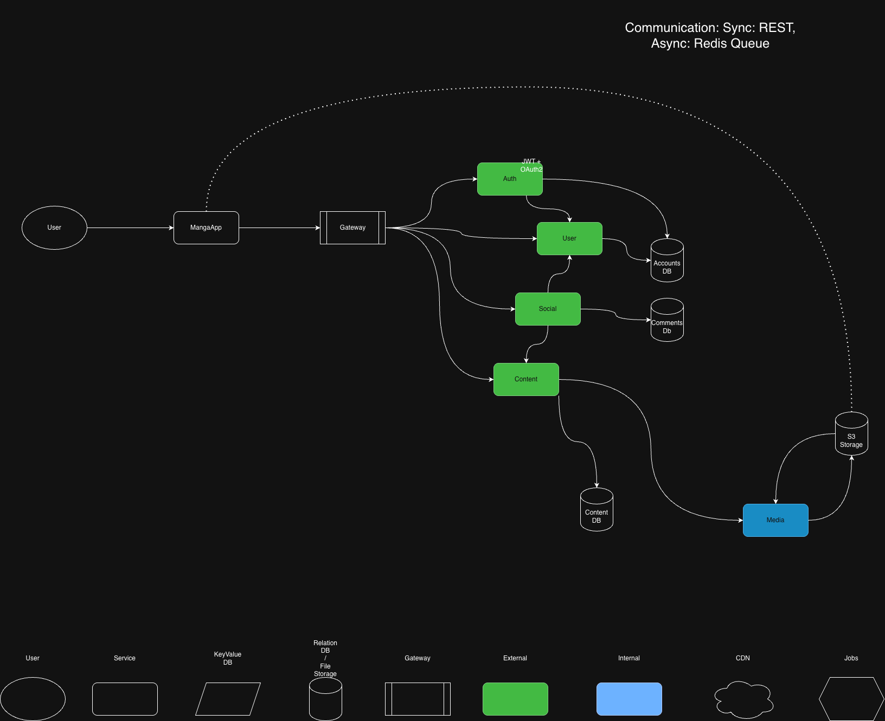
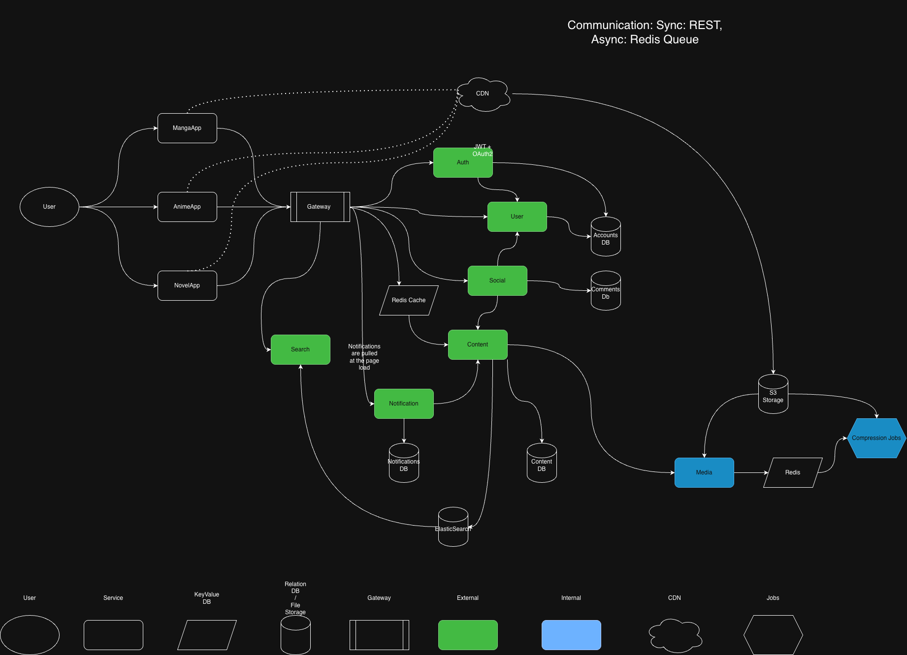

# Temniy-Prince Architecture Design Package

## 1. Project Overview

### 1.1 Problem Summary

**What does your system do?**

A digital platform for manga, light novels, and anime streaming with social features.
It will be an app with 3 frontends, one for each type of content, one for manga, one for novels etc.
But they will be combined through the single user account and characters/franchises that are repeated.
The platform is user driven, so there will be simple users, uploaders (users who have permission to upload new chapters/new titles) and admins.
Each user will have public profiles with library of their titles and each chapter and title will have a tree-like comment section.

**Who are the users?**

- **Guests**: Browse content without an account
- **Users**: Registered users who can read/watch content, maintain libraries, comment
- **Uploaders**: Users with permission to upload new chapters/titles (assigned to specific titles)
- **Moderators**: Users who can moderate content and comments
- **Admins**: Full system access

**What problems does it solve?**

- Unified platform for consuming manga, light novels, and anime
- Cross-franchise navigation (e.g., switching from anime to its source manga)
- Social features with tree-like comment sections
- User progress tracking and library management across all media types
- Content upload and management workflow for uploaders

### 1.2 Core User Flows

**1. User Registration & Profile Creation**
- Action: User signs up via Google OAuth, sets username
- Elements: Client, Gateway, Auth Service, Accounts DB, User Service
- Flow:
  - Auth Service validates credentials, issues JWT
  - User Service creates profile in Accounts DB

**2. Universal Content Search**
- Action: User searches for content across all media types
- Elements: Frontend App, Gateway, Search Service, Elasticsearch, Content DB
- Flow:
  - Query goes to Search Service → Elasticsearch
  - Results include media type (Manga/Anime/Novel) for routing

**3. Media Consumption & History Sync**
- Action: User reads/watches content, progress is saved
- Elements: Frontend App, Gateway, Content Service, CDN, User Service, Accounts DB
- Flow:
  - Content Service returns CDN URLs
  - Frontend sends progress events to User Service
  - History saved in Accounts DB for resume

**4. Threaded Comment Posting**
- Action: User posts comment on specific content
- Elements: Frontend App, Gateway, Social Service, Comments DB, Notification Service
- Flow:
  - Comment stored in Comments DB (linked to content ID)
  - Replies trigger Notification Service

**5. Uploader Publishes New Chapter**
- Action: Uploader uploads ZIP with images for new chapter
- Elements: Gateway, Auth Service, Content Service, Media Service, S3, Redis Queue
- Flow:
  - Auth checks JWT has Uploader role + title permission
  - Media Service uploads to S3 Ingest Bucket
  - Job pushed to Redis Queue
  - Returns "Processing" status immediately

**6. Async Media Compression**
- Action: System processes raw upload in background
- Elements: Redis Queue, Compression Worker, S3, Media Service, Content DB, Notification Service
- Flow:
  - Worker pulls task from Redis
  - Downloads from S3, compresses, uploads to Public Bucket
  - Updates status to "Live" in Content DB
  - Notifies Uploader

**7. Cross-Franchise Navigation**
- Action: User switches from Anime to related Manga
- Elements: AnimeApp, Gateway, Content Service, MangaApp
- Flow:
  - User clicks "View Source Material"
  - Content Service finds linked MangaID
  - Returns deep link (manga-app://title/123)
  - Client switches apps, JWT preserved

**8. New Release Notification Fan-out**
- Action: New chapter goes live, subscribers notified
- Elements: Content Service, Notification Service, User Service, Notifications DB
- Flow:
  - Content Service emits NewChapterCreated event
  - Notification Service fetches subscriber list from User Service
  - Notifications batch-inserted into Notifications DB
  - Users see notifications on next page load

### 1.3 Requirements

**Functional Requirements**

<!-- TODO: To be defined -->

**Non-Functional Requirements**

<!-- TODO: To be defined (scalability, performance, availability, security, observability) -->

---

## 2. Architecture

### 2.1 High-Level Architecture Diagram

#### MVP Architecture

MangaApp only, 5 core services, direct S3, no optimization.



#### Phase I Architecture

Add to MVP:
- AnimeApp, NovelApp
- Search Service + Elasticsearch
- Notification Service
- CDN + Redis Cache
- Compression Jobs + Queue

**Build order:** Cache → CDN → Search → Notifications → Jobs → Apps (parallel)



### 2.2 Architectural Style Decision

**Architectural Patterns:**

- **Microservices**: 7 Backend Services (Auth, Content, Media, User, Social, Search, Notification)
- **Federated Frontend**: 3 apps (MangaApp, NovelApp, AnimeApp), 1 shared auth
- **BFF Pattern**: Backend-for-Frontend for each frontend (server side rendering)
- **Queue-Based Load Leveling**: For async jobs like compression

**Justification:**

<!-- TODO: Explain why microservices over monolith, why container-based vs serverless, etc. -->

### 2.3 Component Breakdown

**Frontend Apps:**
- **MangaApp**: Web frontend for manga reading
- **NovelApp**: Web frontend for light novel reading
- **AnimeApp**: Web frontend for anime streaming

**Backend Services:**
- **Auth Service**: JWT issuance, OAuth2 integration, role/permission validation
- **User Service**: Account management, profiles, libraries, progress tracking
- **Content Service**: Title/chapter metadata, franchise linking
- **Media Service**: File uploads, S3 management, CDN URL generation
- **Social Service**: Tree-like comments, likes, follows
- **Search Service**: Elasticsearch integration, cross-media search
- **Notification Service**: Alert generation, fan-out, delivery

**Data Stores:**
- **PostgreSQL**: Primary database (Accounts DB, Content DB, Comments DB, Notifications DB)
- **Redis**: Cache and job queue
- **S3-compatible**: Media storage (Ingest Bucket, Public Bucket)
- **Elasticsearch**: Full-text search index
- **CDN**: Media delivery

---

## 3. API Design Package

### 3.1 API Paradigm Decision

**Communication:**
- REST + Queues for async jobs like compression

**Justification:**

<!-- TODO: Why REST over GraphQL/gRPC, etc. -->

### 3.2 REST Endpoints

<!-- TODO: 5-12 representative endpoints with request/response examples -->

### 3.3 Authentication & Authorization

**Authentication:**
- JWT tokens
- OAuth2 (Google OAuth for signup/login)

**Authorization Hierarchy:**
```
Guest → User → Uploader → Moderator → Admin
```

**Resource-level permissions:**
- Uploaders are assigned to specific titles
- Only assigned uploaders can upload chapters to their titles

---

## 4. Data Model & Storage

### 4.1 Database Choice & Justification

**Chosen Technologies:**
- **PostgreSQL** (primary relational database)
- **Redis** (cache/queue)
- **S3-compatible** (media storage)
- **Elasticsearch** (search)

**Justification:**

<!-- TODO: Why PostgreSQL over MySQL/MongoDB/DynamoDB, etc. -->

### 4.2 Data Schema

<!-- TODO: Simplified schema diagram with entities, relationships, and database boundaries -->

### 4.3 Data Access & Patterns

**Async Jobs:**
1. On each upload of new images or videos, run async image compression
2. Background jobs for notification delivery

**Caching:**
- Redis Cache for frequently accessed data
- CDN for media delivery

**Patterns:**
- Notifications are pulled at page load (polling, not push)
- Content status transitions: "Processing" → "Live"

---

## 5. Implementation Team Proposals

### MVP (6-8 devs) - 2 Feature Squads

```
Team 1: Core Backend (3-4 devs)
├── Auth Service (JWT)
├── User Service (Accounts DB)
├── API Gateway
└── Content DB Schema

Team 2: Product & Experience (3-4 devs)
├── MangaApp Frontend (Web)
├── Media Service (Direct S3)
└── Social (Comments)
```

### Phase I (10-14 devs) - 3 Specialized Layers

```
Team 1: Frontend Federation (4-5 devs)
├── MangaApp, AnimeApp, NovelApp
├── BFF pattern
└── Cross-app navigation

Team 2: Platform & Infrastructure (3-4 devs)
├── Search Service (Elasticsearch)
├── Redis Cache
├── CDN integration
├── Async Compression Workers
└── DevOps/Deployments

Team 3: Core Services (3-4 devs)
├── Auth/User maintenance
├── Content Service
├── Notification Service
└── Social scaling
```

### Structure Evolution

As complexity grows:

1. Frontend separates to manage three distinct interfaces (Video/Text/Image readers)
2. Infrastructure gets dedicated focus for Elasticsearch, CDN, and Compression Queues
3. Core Services maintains shared business logic

---

## Future Phases

### Phase II

| Feature               | Signal                 |
|-----------------------|------------------------|
| Recommendation Engine | 10K+ users             |
| Native Mobile Apps    | asap                   |
| Advanced Search       | High search refinement |
| Moderation Tools      | Differentiation        |

### Future Phases

| Feature                 | Signal                                |
|-------------------------|---------------------------------------|
| WebSocket Notifications | There is a demand for instant updates |
| Creator Analytics       | 500+ uploaders                        |
| Paid chapters/episodes  | Revenue needed                        |
| Forums                  | >100 comments/day                     |
| AI Features             | Differentiation                       |
